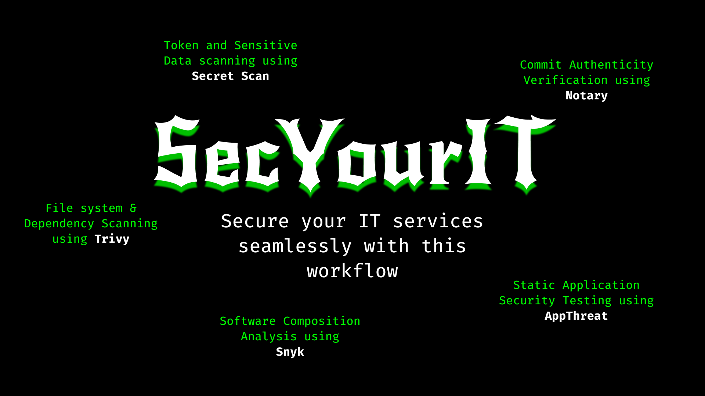

**SecYourIT**:  _Secure your IT services seamlessly with this workflow_

Run SecYourIt in any of your application. Let it be a CLI, a Web-App, an App, any software, SecYourIT is there for you.

## Usage
You can trigger this workflow as simple as
```yaml
jobs:
    secyourit:
        uses: shubhampalriwala/secyourit/.github/workflows/secryourit.yaml@master
        with:
            signerID: 
            org: 
            path:
            language:
        secrets:
            SNYK_API_TOKEN: ${{secrets.SNYK_API_TOKEN}}
```

## Parameters:
| Name | Type | Use | Required | Description |
| ----- | ----- | ------ | ----- | ----- |
| SignerID | Input | Notary Commit Verification | false | List of SignerID(s) (separated by space) to authenticate against. A SignerID is the signer's public address (represented as a 40 hex characters long string prefixed with 0x) |
| Org | Input | Notary Commit Verification | false | Organization's ID to authenticate against. Note that org takes precedence over signerID |
| Path | Input | Notary Commit Verification | true | Path to git working directory. Default to the current SecYourIT repo |
| Language | Input | SCA and SAST | true | The language is required to run static analysis of the code and point out the flaws |
| Snyk API Token | Secret | SCA using Snyk | true | Snyk API token to allow Snyk to authenticate you and show you the results on the dashboard |

For more information about 
- Notary parameters, view [here](https://github.com/vchain-us/docs/blob/master/site/integrations/verify-commit-action.md#inputs)
- Snyk API key, view [here](https://github.com/snyk/actions#getting-your-snyk-token)

## Breaking down SecYourIT

SecYourIT under the hood uses the following actions:
- [Max/Secret-Scan](https://github.com/marketplace/actions/secret-scan) to scan for tokens and sensitive date
- [VChain-US/Verify-Action](https://github.com/vchain-us/verify-action) to verify the authenticity of the commits
- [AquaSecurity/Trivy-Action](https://github.com/aquasecurity/trivy-action) to scan the file system and the dependencies for vulnerabilities
- [Snyk/Actions](https://github.com/snyk/actions) to perform Software Composition Analysis
- [AppThreat/sast-scan-action](https://github.com/AppThreat/sast-scan) to perform Static Application Security Testing

## Figma Page
All the designs have been made by me with the feedback and suggestions from my designer friends [here on Figma](https://www.figma.com/file/GtVvanvVW1bPjJqiffqOvw/SecYourIT?node-id=9%3A47).

## Contributions

- Feel Free to Open a PR/Issue for any feature or bug(s).
- Make sure to follow the [community guidelines](https://docs.github.com/en/github/site-policy/github-community-guidelines) when contributing.
- Please open an issue if you want to ask a question/discuss anything about SecYourIT or even DevSecOps.
- Want to add an action? add a feature? Open an Issue!

## License

Copyright 2021 Shubham Palriwala

Licensed under [MIT License](https://opensource.org/licenses/MIT)

<p align="center">Made with ❤ under a Christmas Tree</p>

